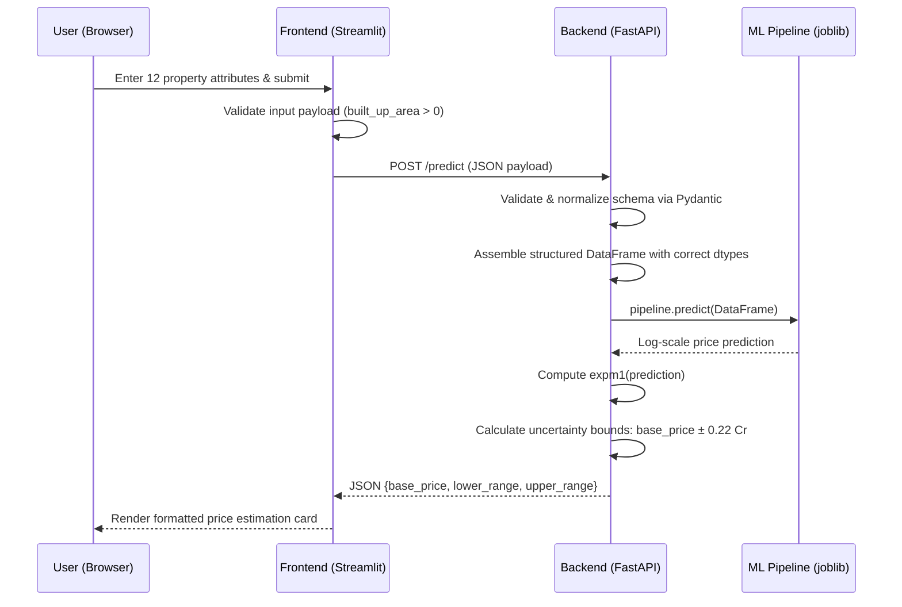
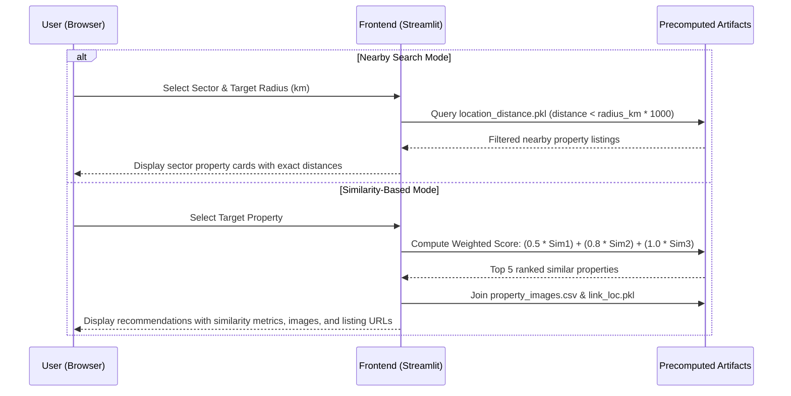

# Habitalytics

[](https://python.org)
[](https://fastapi.tiangolo.com)
[](https://streamlit.io)
[](https://scikit-learn.org)
[](https://pandas.pydata.org)
[](https://plotly.com)
[](https://docker.com)

Habitalytics is a machine learning–powered real estate analytics platform focused on the Gurugram (Gurgaon) property market, designed to analyze, visualize, and predict real estate trends. It integrates predictive price modeling, interactive exploratory data analysis, and an intelligent property recommendation system into a full-stack web application.

---

## Table of Contents

- [Overview](#overview)
- [System Architecture](#system-architecture)
- [Key Features](#key-features)
- [Tech Stack](#tech-stack)
- [Repository Structure](#repository-structure)
- [Machine Learning & Model Benchmarking](#machine-learning--model-benchmarking)
- [Data Pipeline](#data-pipeline)
- [Getting Started & Local Development](#getting-started--local-development)
- [Configuration & Environment Variables](#configuration--environment-variables)
- [API Reference & Data Contracts](#api-reference--data-contracts)
- [Containerization & Deployment](#containerization--deployment)
- [Contributing](#contributing)
- [License & Disclaimer](#license--disclaimer)
- [Author & Contact](#author--contact)

---

## Overview

Real estate market participants frequently encounter non-transparent property valuations, unstructured listings, and subjective pricing assessments. Habitalytics resolves these challenges by providing:

- **Predictive Property Valuation**: Automated price estimation powered by a tuned Random Forest regression pipeline evaluating 12 physical and spatial attributes.
- **Exploratory Market Analytics**: Interactive sector-level visualizations detailing spatial price-per-sqft distributions, built-up area correlations, BHK configurations, and amenity frequencies.
- **Hybrid Recommendation Engine**: Distance-radius spatial queries combined with weighted multi-factor cosine similarity scoring across property amenities, configuration patterns, and landmark proximity.

---

## System Architecture

### Predictive Price Valuation Flow



### Recommendation Engine Flow



---

## Key Features

- **Property Valuation Engine**: Evaluates 12 input features (property type, sector, bedrooms, bathrooms, balconies, age of possession, built-up area, servant room, store room, furnishing type, luxury category, and floor category) to return a base price in Indian Crores (₹) with a ±0.22 Cr confidence interval.
- **Interactive Analytics Dashboard**:
  - Geospatial scatter map of sector-wise price per sqft rendered via Plotly and OpenStreetMap tiles.
  - Amenity extraction rendered via sector-level dynamic word clouds.
  - Built-up area versus price scatter plots segmented by BHK configurations.
  - Sector-level and overall BHK distribution pie charts and price spread box plots.
  - Comparative histograms evaluating price spreads between flats and independent houses.
- **Dual Recommendation Modes**:
  - **Nearby Search**: Radius-based spatial search within a user-defined kilometer threshold using pairwise sector distance calculations.
  - **Similarity Search**: Weighted content-based filtering combining precomputed cosine similarity matrices for amenities (weight: 0.5), configuration patterns (weight: 0.8), and landmark proximity (weight: 1.0).
- **Listing Asset Resolution**: Scraped 99acres listing assets dynamically mapped to properties with fallback placeholder handling.

---

## Tech Stack

| Layer | Component | Version | Purpose |
|---|---|---|---|
| **Runtime & Language** | Python | `>= 3.8` (Docker: `3.12-slim`) | Core execution environment |
| **Backend API** | FastAPI | `0.115.0` | Asynchronous REST API routing |
| **ASGI Server** | Uvicorn (standard) | `0.30.6` | Production ASGI server |
| **Data Validation** | Pydantic | `2.9.2` | Request and response schema enforcement |
| **Frontend UI** | Streamlit | `1.50.0` | Analytical user interface |
| **UI Components** | streamlit-option-menu | `0.4.0` | Multi-page sidebar navigation |
| **Machine Learning** | scikit-learn | `1.7.2` | Core inference pipeline (Random Forest) |
| **Model Experimentation** | XGBoost | `>= 1.7.0` | Benchmark model evaluation in notebooks |
| **Categorical Encoding** | category-encoders | `2.9.0` | Target and categorical feature transformations |
| **Model Serialization** | joblib | `1.4.2` | Pipeline artifact persistence (`pipeline.joblib`) |
| **Data Processing** | pandas / numpy | `2.3.3` / `2.3.4` | Tabular data manipulation and vector math |
| **Statistical Analysis** | scipy | `>= 1.10.0` | Statistical distributions and testing |
| **Geospatial & Charts** | Plotly | `6.3.1` | Geospatial tile maps and interactive charts |
| **Visual Rendering** | Matplotlib / Seaborn | `3.10.7` / `0.13.2` | Statistical plots and word clouds |
| **Word Cloud Engine** | wordcloud | `1.9.4` | Sector amenity frequency visual rendering |
| **Web Scraping** | BeautifulSoup4 / Requests | `4.12.2` / `2.28.2` | Offline listing scraping from 99acres |
| **Browser Automation** | Selenium | `4.16.0` | Dynamic listing extraction pipelines |
| **Geocoding** | Geopy (Nominatim) | Latest | Sector coordinate geocoding via OpenStreetMap |
| **Storage Architecture** | File-Based Artifacts | N/A | Persistent `.csv`, `.pkl`, and `.joblib` storage |

---

## Repository Structure

```
Habitalytics/
├── pyproject.toml                         # Project metadata & build definitions (Python >= 3.8)
├── config/                                # Centralized configuration package
│   ├── __init__.py                        # Path constant exports
│   └── paths.py                           # Root directory detection & data path definitions
├── data/                                  # Centralized data storage
│   ├── raw/                               # Raw scraped CSVs (flats.csv, houses.csv, appartments.csv)
│   ├── processed/                         # Cleaned/engineered datasets across 9 pipeline stages
│   ├── analytics/                         # Dashboard analytics datasets & sector coordinates
│   └── recommender/                       # Recommender metadata and asset mapping datasets
├── models/                                # Serialized models and similarity matrices
│   ├── pipeline.joblib                    # Trained Random Forest regression pipeline (~42 MB)
│   ├── cosine_sim{1,2,3}.pkl             # Precomputed cosine similarity matrices
│   ├── df.pkl                             # UI feature reference dataset
│   ├── feature_text.pkl                   # Text embeddings and feature mappings
│   ├── link_loc.pkl                       # Property-to-listing URL mapping
│   ├── location_distance.pkl              # Pairwise sector distance matrix
│   └── wordcloud_df.pkl                   # Tokenized sector amenity dataset
├── notebooks/                             # 11-stage research and machine learning pipeline
│   ├── 01_data_collection/               # 99acres scraping scripts
│   ├── 02_preprocessing/                 # Data cleaning and record merges
│   ├── 03_feature_engineering/           # Attribute extraction and transformation
│   ├── 04_eda/                           # Exploratory data analysis
│   ├── 05_outlier_detection/              # Outlier detection and treatment
│   ├── 06_missing_value_imputation/       # Missing value strategies
│   ├── 07_feature_selection/             # Feature importance analysis
│   ├── 08_baseline_model/                 # Benchmark modeling
│   ├── 09_model_selection/                # Final pipeline evaluation and export
│   ├── 10_analytics/                      # Analytics data preparation
│   ├── 11_recommender/                    # Recommender matrix construction
│   └── requirements.txt                   # Notebook-specific environment dependencies
├── scripts/                               # Standalone automation and extraction utilities
│   ├── 99_acres_scrap.py                  # Listing scraper with rate-limiting controls
│   ├── latlong_scraper.py                 # Sector coordinate geocoder (Nominatim)
│   └── generate_images.py                 # Listing image extractor
└── webapp/                                # Production application code
    ├── .streamlit/
    │   └── config.toml                    # Streamlit server and dark theme configuration
    ├── backend/                           # FastAPI service
    │   ├── api.py                         # REST API application and prediction endpoints
    │   ├── pipeline.joblib                # Serialized model artifact for container build
    │   ├── Dockerfile                     # Multi-stage production build (Python 3.12-slim)
    │   ├── requirements.txt               # Backend runtime dependencies
    │   └── README.md
    └── frontend/                          # Streamlit analytical client
        ├── Home.py                        # Web application entry point
        ├── sidebar.py                     # Navigation configuration module
        ├── df.pkl                         # Dropdown reference data
        ├── sector_coordinates.csv         # Sector mapping coordinates
        ├── Dockerfile                     # Multi-stage frontend build (Python 3.12-slim)
        ├── requirements.txt               # Frontend runtime dependencies
        ├── README.md
        ├── static/
        │   ├── theme.css                  # Custom dark theme and responsive stylesheet
        │   └── sidebar.js                 # Dynamic DOM adjustments
        ├── datasets/                      # Static runtime analytical and recommender assets
        │   ├── cosine_sim{1,2,3}.pkl
        │   ├── data_viz1.csv
        │   ├── feature_text.pkl
        │   ├── link_loc.pkl
        │   ├── location_distance.pkl
        │   ├── wordcloud_df.pkl
        │   ├── property_images.csv
        │   └── logo4_upscaled.jpg
        └── pages/
            ├── Analytics_Dashboard.py     # Market visualization module
            ├── Property_Valuation.py      # ML valuation client interface
            └── Property_Recommender.py    # Spatial & similarity recommendation interface
```

---

## Machine Learning & Model Benchmarking

### Model Evaluation & Selection

11 regression algorithms were benchmarked using 10-fold cross-validation on the engineered dataset:

| Algorithm | Model Description | Status |
|---|---|---|
| **Linear Regression** | Baseline ordinary least squares | Evaluated |
| **Support Vector Regressor (SVR)** | Support Vector Regression with RBF kernel | Evaluated |
| **Ridge Regression** | Linear regression with L2 regularization | Evaluated |
| **Lasso Regression** | Linear regression with L1 regularization | Evaluated |
| **Decision Tree Regressor** | Non-linear decision tree | Evaluated |
| **Random Forest Regressor** | Optimized ensemble of decision trees | **Selected Final Model** |
| **Extra Trees Regressor** | Extremely randomized decision trees | Evaluated |
| **Gradient Boosting Regressor** | Sequential gradient boosted decision trees | Evaluated |
| **AdaBoost Regressor** | Adaptive boosting ensemble | Evaluated |
| **Multi-Layer Perceptron (MLP)** | Feedforward neural network regressor | Evaluated |
| **XGBoost Regressor** | Extreme Gradient Boosting framework | Evaluated |

### Final Model Performance & Hyperparameters

- **Holdout Evaluation Metrics**:
  - **R² Score**: `0.87`
  - **Mean Absolute Error (MAE)**: `0.45 Crores (₹)`
- **Hyperparameter Optimization (`RandomizedSearchCV`)**:
  - `n_estimators`: `200`
  - `max_depth`: `25`
  - `max_samples`: `0.6`
  - `max_features`: `0.8`
  - `min_samples_split`: `2`
  - `min_samples_leaf`: `1`

### Inference Pipeline Transformations

- **Numerical Features**: `StandardScaler` applied to built-up area, bedroom, bathroom, servant room, and store room counts.
- **Categorical Features**: `OrdinalEncoder` applied to `property_type`, `balcony`, `furnishing_type`, `luxury_category`, and `floor_category`.
- **Nominal Features**: `OneHotEncoder` applied to `agePossession`.
- **High-Cardinality Locations**: `TargetEncoder` (from `category-encoders`) applied to Gurugram sectors.
- **Target Variable**: Log-transformed via `log1p` during training; inverse-transformed via `expm1(prediction)` at inference.

---

## Data Pipeline

The data engineering and model training workflow is structured across 11 sequential stages in `notebooks/`:

```
01_data_collection           Automated 99acres listing and asset extraction
       │
02_preprocessing             Data cleaning, deduplication, and schema merge for flats and houses
       │
03_feature_engineering       Creation of derived metrics (luxury score, floor category)
       │
04_eda                       Univariate, bivariate, and spatial distribution analysis
       │
05_outlier_detection         Interquartile Range (IQR) detection and treatment on price/sqft
       │
06_missing_value_imputation  Domain-specific ratio imputation for area measurements
       │
07_feature_selection         Feature importance ranking and multicollinearity reduction
       │
08_baseline_model            Comparative algorithmic benchmarking across 11 regression models
       │
09_model_selection           Hyperparameter optimization and export to pipeline.joblib
       │
10_analytics                 Dataset preparation for frontend dashboards and map layers
       │
11_recommender               Computation of pairwise distance and 3 cosine similarity matrices
```

---

## Getting Started & Local Development

### Prerequisites

- **Python**: Version `3.8+` (`3.12` recommended)
- **pip**: Latest Python package manager
- **Model Artifact**: `pipeline.joblib` located in `webapp/backend/`
- **Data Assets**: Serialized `.pkl` and `.csv` files inside `webapp/frontend/datasets/`

> Note: Running the web application requires no external API keys. Internet access is only needed if executing the offline scrapers against 99acres or Nominatim.

---

### Local Installation Steps

1. **Clone the repository and install the config package:**
   ```bash
   git clone [https://github.com/Areeb-Ahmd/Habitalytics-DataDrivenRealty.git](https://github.com/Areeb-Ahmd/Habitalytics-DataDrivenRealty.git)
   cd Habitalytics
   pip install -e .
   ```

2. **Start the Backend API (Terminal 1):**
   ```bash
   cd webapp/backend
   pip install -r requirements.txt
   python api.py
   ```
   - API Endpoint: `http://localhost:8000`
   - Swagger UI Documentation: `http://localhost:8000/docs`
   - ReDoc Interface: `http://localhost:8000/redoc`

3. **Start the Frontend Application (Terminal 2):**
   ```bash
   cd webapp/frontend
   pip install -r requirements.txt

   # Linux / macOS:
   export API_URL="http://localhost:8000"

   # Windows (PowerShell):
   $env:API_URL="http://localhost:8000"

   # Windows (CMD):
   set API_URL=http://localhost:8000

   streamlit run Home.py
   ```
   - Access the dashboard at `http://localhost:8501`.

4. **Working with Research Notebooks:**
   The repository uses a centralized path configuration package (`config/`):
   ```python
   from config import DATA_RAW, DATA_PROCESSED, DATA_ANALYTICS, DATA_RECOMMENDER, MODELS_DIR, PROJECT_ROOT
   import pandas as pd
   import joblib

   # Load processed data
   df = pd.read_csv(DATA_PROCESSED / 'gurgaon_properties_cleaned_v1.csv')

   # Persist trained model
   joblib.dump(model, MODELS_DIR / 'pipeline.joblib')
   ```

---

## Configuration & Environment Variables

### Environment Variables

| Variable | Scope | Required | Default Value | Description |
|---|---|---|---|---|
| `API_URL` | Frontend | No | `http://localhost:8000` | Backend API base URL used for `/predict` calls |
| `PORT` | Backend | No | `8000` | Server listen port (auto-injected in Cloud Run) |
| `PORT` | Frontend | No | `8080` | Streamlit port in Docker (auto-injected in Cloud Run) |

### Streamlit Configuration (`webapp/.streamlit/config.toml`)

| Section | Key | Value | Description |
|---|---|---|---|
| `[server]` | `runOnSave` | `true` | Auto-reloads UI when code files change |
| `[server]` | `fileWatcherType` | `"auto"` | Automatic file system watcher mode |
| `[runner]` | `fastReruns` | `true` | Optimizes script execution graph reruns |
| `[runner]` | `magicEnabled` | `true` | Enables Streamlit magic commands |
| `[client]` | `showErrorDetails` | `true` | Displays detailed error tracebacks |
| `[theme]` | `primaryColor` | `#5fcf7c` | Emerald green platform accent |
| `[theme]` | `backgroundColor` | `#0e1117` | Primary dark background canvas |
| `[theme]` | `secondaryBackgroundColor` | `#262730` | Container and sidebar panel background |
| `[theme]` | `textColor` | `#ffffff` | Primary text styling |

---

## API Reference & Data Contracts

### HTTP Endpoints

| Method | Endpoint | Description | Authentication |
|---|---|---|---|
| `GET` | `/` | Root service health check and operational status | None |
| `GET` | `/health` | Detailed probe reporting model initialization state | None |
| `POST` | `/predict` | Property valuation inference using 12 input features | None |
| `GET` | `/docs` | Interactive Swagger UI API explorer | None |
| `GET` | `/redoc` | ReDoc OpenAPI documentation | None |

---

### Valuation Data Contracts

#### Request Payload (`POST /predict`)

```json
{
  "property_type": "flat",
  "sector": "Sector 1",
  "bedRoom": 2.0,
  "bathroom": 2.0,
  "balcony": "2",
  "agePossession": "New Property",
  "built_up_area": 1200.0,
  "servant_room": 0.0,
  "store_room": 1.0,
  "furnishing_type": "Semi-Furnished",
  "luxury_category": "Medium",
  "floor_category": "Mid"
}
```

#### Response Payload (`POST /predict`)

```json
{
  "base_price": 1.45,
  "lower_range": 1.23,
  "upper_range": 1.67
}
```

*Note: All output prices are computed in Indian Crores (₹) via `expm1(prediction)` with an uncertainty margin of `±0.22 Cr`.*

---

## Containerization & Deployment

Both services feature multi-stage Docker builds based on `python:3.12-slim`.

### 1. Backend Service Build & Run

```bash
cd webapp/backend
docker build -t habitalytics-backend .
docker run -d -p 8000:8000 -e PORT=8000 habitalytics-backend
```
*System Dependencies Included*: `libgomp1` (required for OpenMP multi-threading in scikit-learn).

### 2. Frontend Service Build & Run

```bash
cd webapp/frontend
docker build -t habitalytics-frontend .
docker run -d -p 8080:8080 \
  -e PORT=8080 \
  -e API_URL=[http://host.docker.internal:8000](http://host.docker.internal:8000) \
  habitalytics-frontend
```
*System Dependencies Included*: `fonts-dejavu-core`, `libfreetype6`, `libpng16-16` (required for Matplotlib and WordCloud rendering).

### Cloud Deployment Notes

- **Target Platform**: Google Cloud Run (services bind dynamically to `$PORT`).
- **Artifact Preparation**: Ensure `pipeline.joblib` is present in `webapp/backend/` and all `.pkl` / `.csv` assets are inside `webapp/frontend/datasets/` prior to building container images.
- **CORS Configuration**: Restrict `allow_origins=["*"]` in `api.py` to the production frontend domain for public deployment.

---

## Contributing

1. Fork the repository (`https://github.com/Areeb-Ahmd/Habitalytics-DataDrivenRealty`)
2. Create a feature branch (`git checkout -b feature/AmazingFeature`)
3. Commit your changes (`git commit -m 'Add some AmazingFeature'`)
4. Push to the branch (`git push origin feature/AmazingFeature`)
5. Open a Pull Request

---

## License & Disclaimer

### License
This project is open source and available under the [MIT License](LICENSE).

### Disclaimer
This platform is developed for educational and research purposes. Valuations and recommendations are estimates generated from historical data patterns and must not be considered formal financial, appraisal, or legal advice.

---

## Author & Contact

- **Syed Areeb Ahmad**
- **Email**: [ahmad.syedareeb7@gmail.com](mailto:ahmad.syedareeb7@gmail.com)
- **LinkedIn**: [areeb-ahmad7](https://www.linkedin.com/in/areeb-ahmad7)
- **GitHub**: [@Areeb-Ahmd](https://github.com/Areeb-Ahmd)
